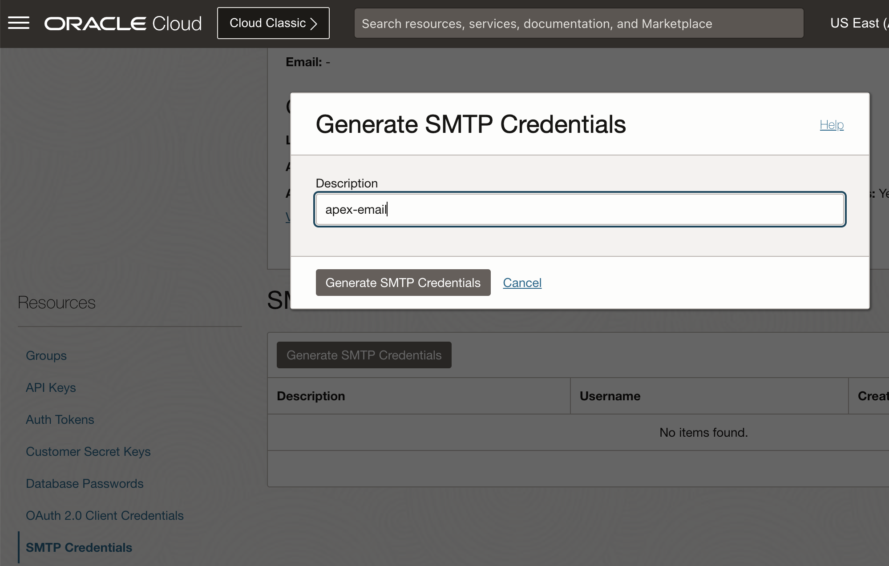
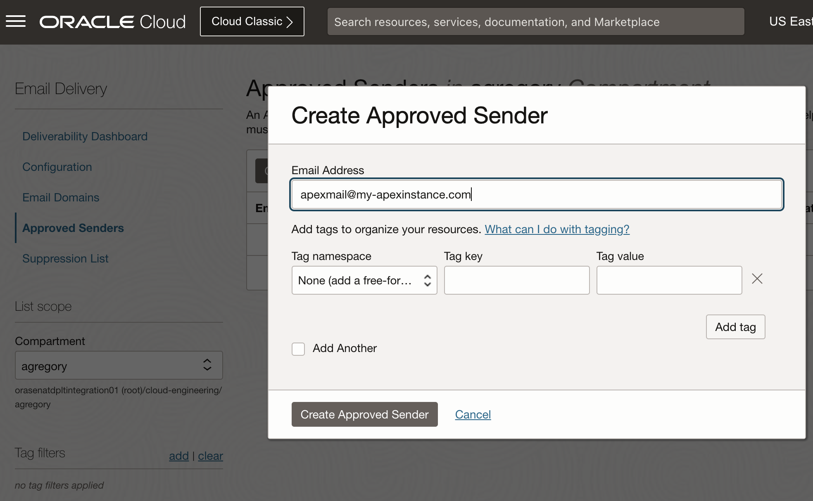
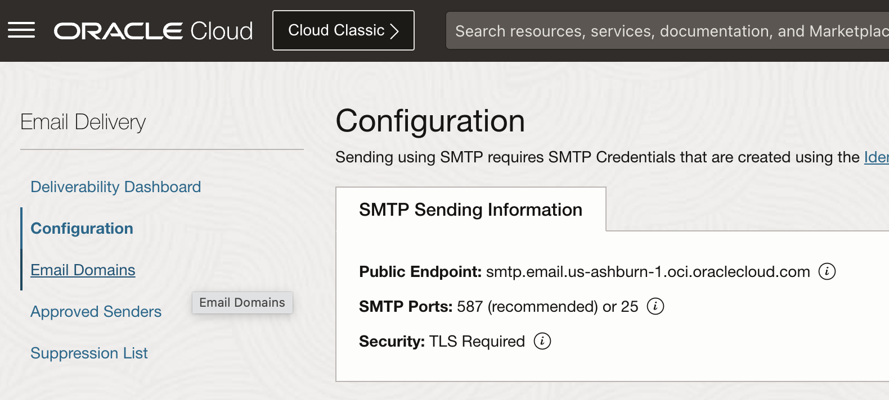
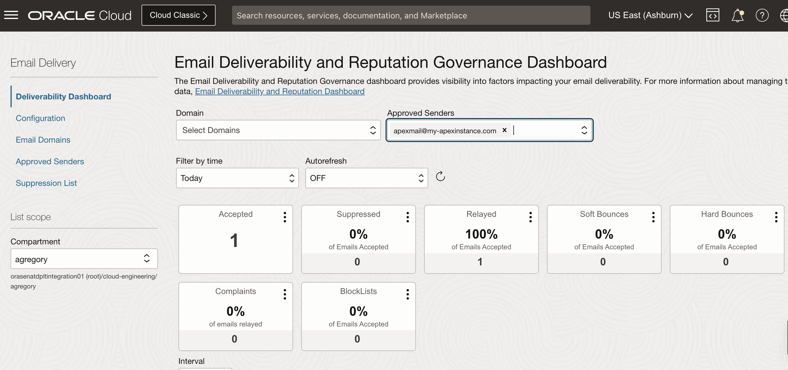
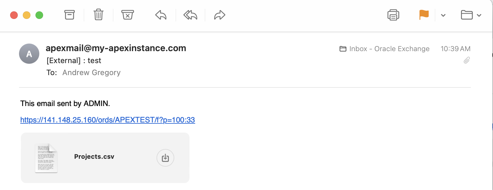

# Enabling Outbound Email from APEX
If you create an ADB-D instance and want to send email outbound, there are several main steps, covered here:

- Create an Email Delivery Approved Sender
- Create SMTP Credentials under your account
- Update APEX environment

Here are the details for each part of the config

## Email Delivery Setup

Start with your account and create an SMTP Credential. Record these values for user and password.



Next create an Approved Sender - this can be any email where your outbound emails will come "from".



Finally, record the basic config details for host and port - we will use 25



## Log into APEX

We can use the APEX INTERNAL Workspace with ADMIN to see the email details, but we need to run SQL to create an ACL allowing outbound connections. To do this, we can use the SQL Worksheet or a command shell for SQL Plus, described on the other pages in this repo.

The following will enable a newly created user.  The first statement adds the required ACL for outbound mail on port 25.  The next sets your specific email details (please replace).  Finally, the validation can run from SQL as well.:
```sql
begin
  DBMS_NETWORK_ACL_ADMIN.APPEND_HOST_ACE (
    host       => 'smtp.email.us-ashburn-1.oci.oraclecloud.com',
    lower_port => 25,
    upper_port => 25,
    ace        => xs$ace_type(
                    privilege_list => xs$name_list('smtp'),
                    principal_name => 'APEX_230100',
                    principal_type => xs_acl.ptype_db));
end;
/

BEGIN
    APEX_INSTANCE_ADMIN.SET_PARAMETER('SMTP_HOST_ADDRESS', 'smtp.email.us-ashburn-1.oci.oraclecloud.com');
    APEX_INSTANCE_ADMIN.SET_PARAMETER('SMTP_USERNAME', 'ocid1.user.oc1..aaaaaaaazi2fdcfuv3noqvmhisggzk2ecwf6aqppn5hblr7znfvx745rqrkq@ocid1.tenancy.oc1..aaaaaaaackopa27emaz4uteg4sseutmk3qq73iyoymttpyjdu34bilvxo3da.3t.com');
    APEX_INSTANCE_ADMIN.SET_PARAMETER('SMTP_PASSWORD', '&prompt');
    APEX_INSTANCE_ADMIN.SET_PARAMETER('SMTP_HOST_PORT', 25);
    APEX_INSTANCE_ADMIN.SET_PARAMETER('SMTP_TLS_MODE', 'STARTTLS');
    APEX_INSTANCE_ADMIN.SET_PARAMETER('SMTP_FROM', 'apexmail@my-apexinstance.com');
    COMMIT;
END;
/

BEGIN
    APEX_INSTANCE_ADMIN.VALIDATE_EMAIL_CONFIG;
END;
/
```

## Testing Email

From any APEX page, the Download option offers an email option.  Put in your email and check the following SQL to see it in the Mail Queue:


```sql
SELECT * from APEX_MAIL_QUEUE;
SELECT * from APEX_MAIL_LOG;
```

You can also look under Email Delivery in OCI Console and see if your message was accepted and relayed:



## Success

Email comes after a coule minutes:


