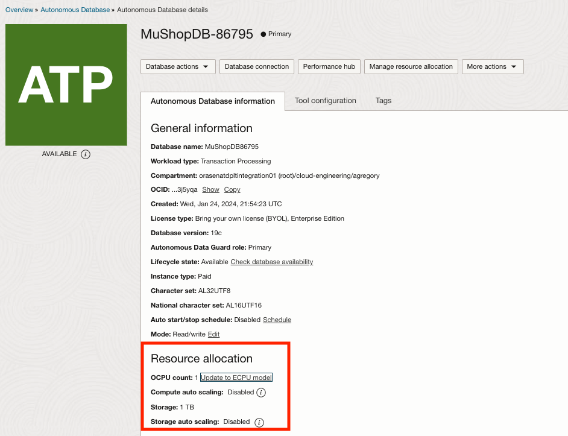
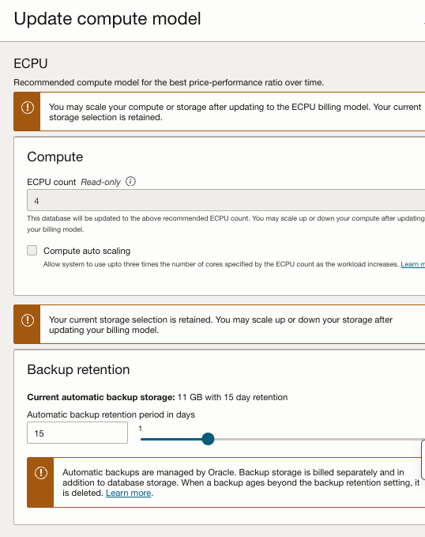
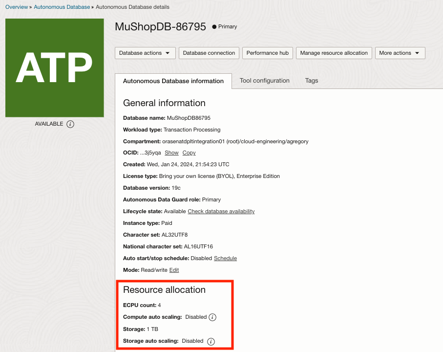
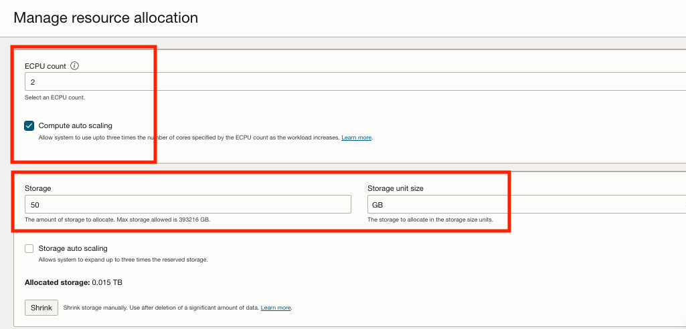
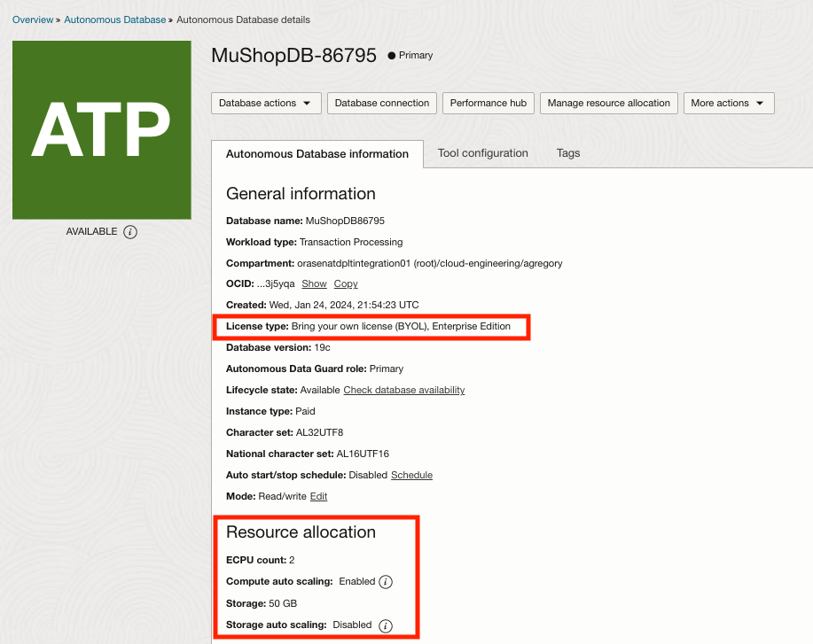
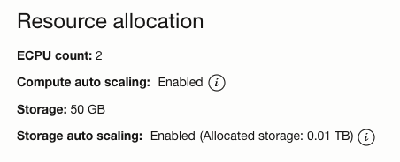
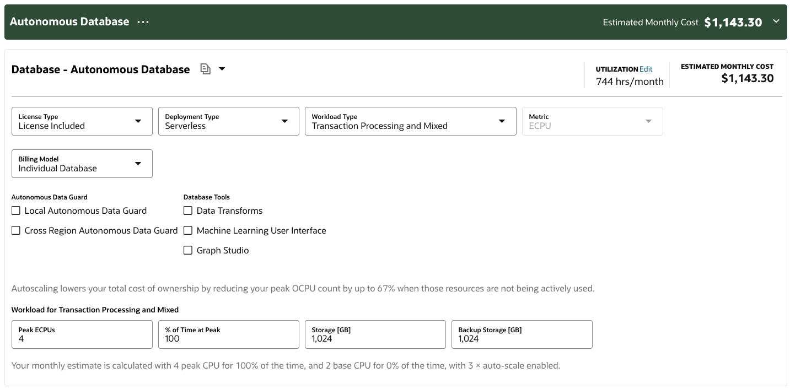
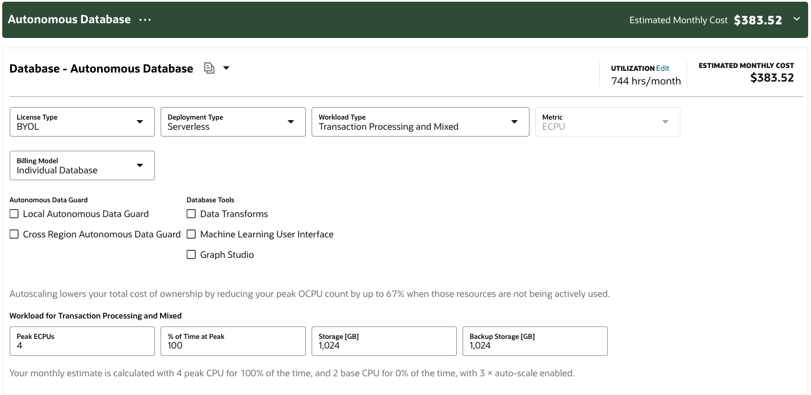
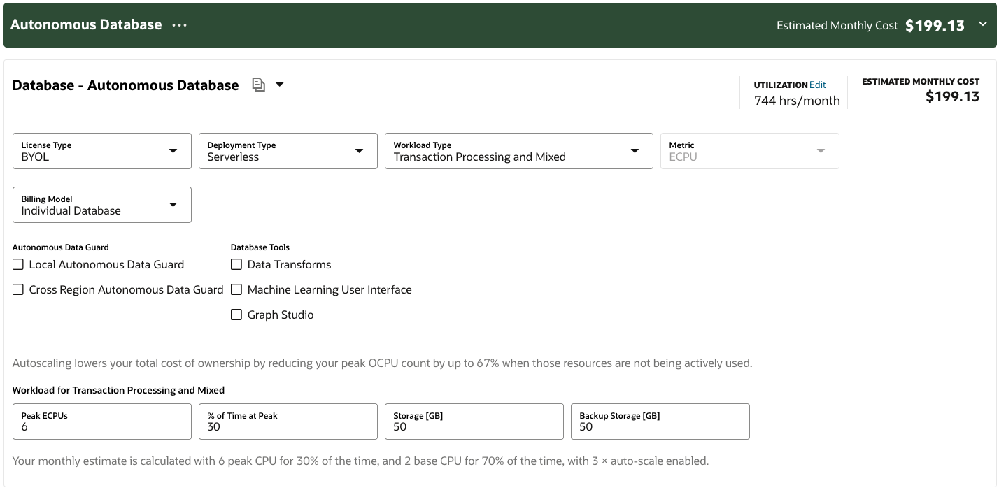

# How to Scale Down ATP Serverless

We now (as of ECPU release) are encouraging customers to convert to or initiate ATP-Serverless instances using the ECPU model, which allows for less than 1 OCPU to be allocated.  Auto-scaling CPU also can be enabled in order to scale to 3x during peak loads.

More importantly, the storage minimum for ATP is now in GB, instead of TB.  This means we can downsize any existing ATP instances to consume less storage.  Across hundreds of ATP instances, this adds up quickly.  Now that we can reduce storage, this document will show how.

To see how dramatic this cost reduction can be, click below.
[Cost Analysis](#cost-analysis)

## Overall Process with Screen Shots

The process is simple.  Existing instances must be:
* Autonomous Transaction Processing - Serverless
* Running
* Not updating in any other way

To get to smaller storage, there are 2 steps that must be completed:
1) Convert to ECPU model (1 OCPU -> 4 ECPU)
2) After conversion, scale storage into GB, using an amount closer to what is needed

*NOTE - Storage Auto-scaling can be enabled as well, so that if you exceed the allocated amount, more storage can be provisioned for the instance.*

*REMINDER - Also take this opportunity to ensure that instances use BYOL Licensing, instead of License Included*

### Prior to migration

### Migration Screen

### After ECPU migration

### Scaling Down

### After Scaling

### Storage Auto-Scale (Optional)

### With Storage Auto-Scale Enabled (Optional)

## Cost Analysis

Here are some cost comparisons.  Note that OCPU model is not available in the cost calculator, so a 1 OCPU instance is represented as a 4 ECPU 100% peak, such that it consumes 1 full OCPU when on.

The following screen shots show how dramatic it can be to incorrectly size an ATP instance and leave it running 24/7.  Over hundreds of instances in our lab (or at a customer), this can add up quickly.

### License Included, 1 OCPU, 1 TB, Running 24/7

### BYOL, 1 OCPU, 1 TB, Running 24/7

### BYOL, 2 ECPU (auto-scale), 50 GB (auto-scale), Running 24/7

### BYOL, 2 ECPU (auto-scale), 50 GB (auto-scale), Running 10hrs, 22 days a month

