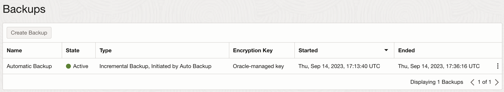
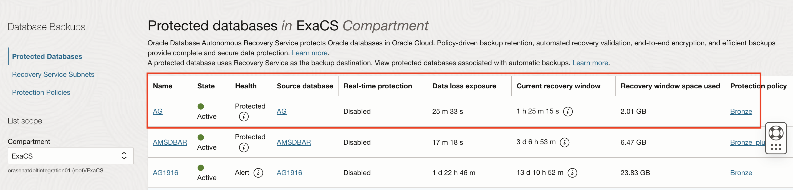
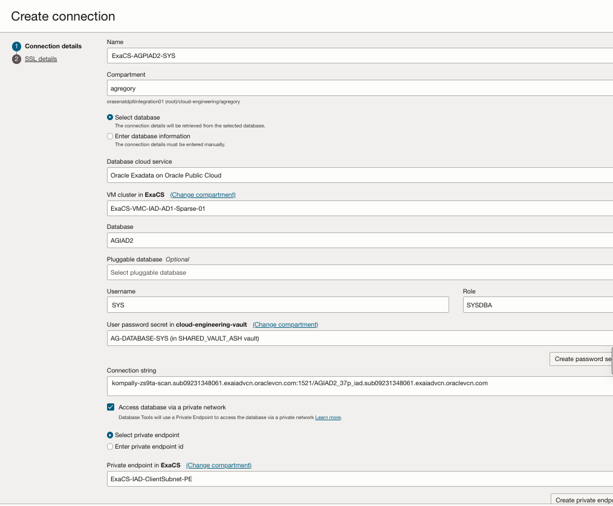
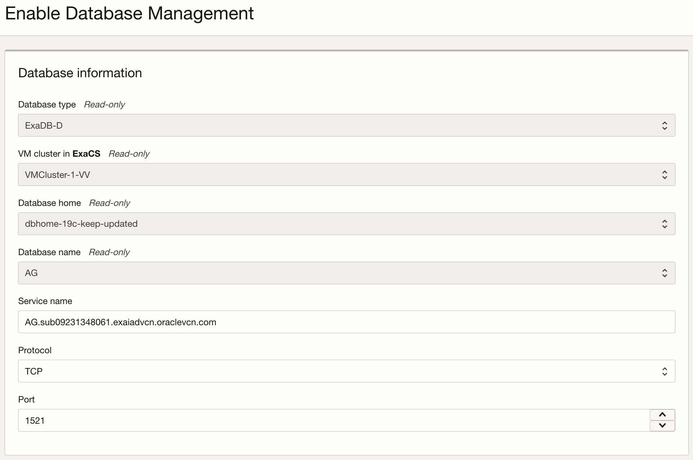
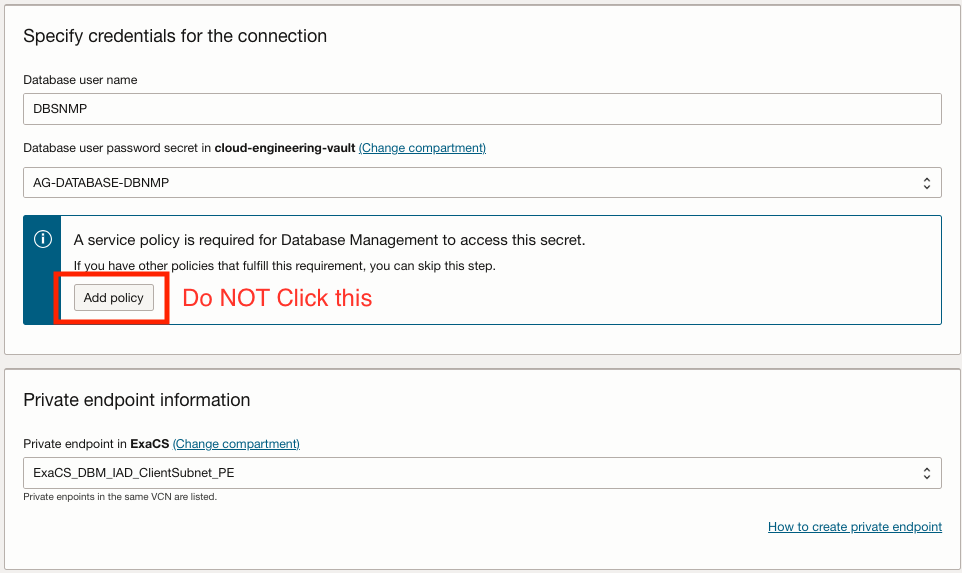
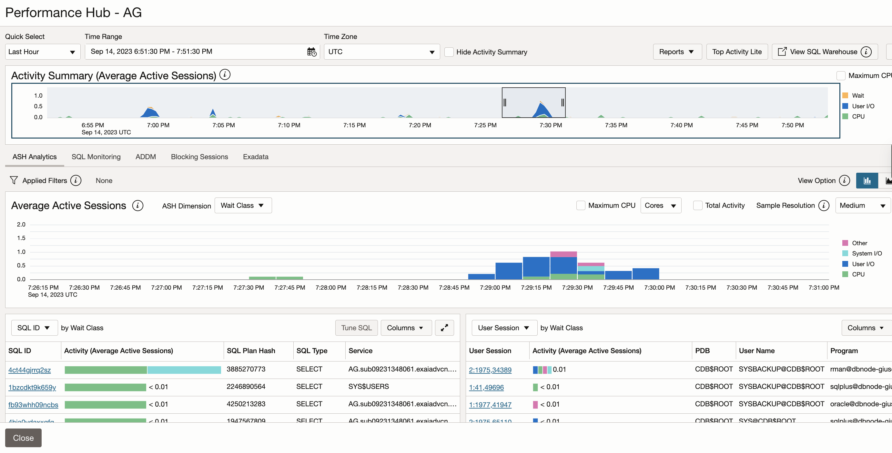

# Using Database-Related Tools and Services

This page covers the following:
- Using Autonomous Recovery Service
- Using SQL Worksheet
- Using Database Management

All of these tools and services are available in our tenancy, but should be used with caution.  There are limits we must respect, so please follow the rules here and remember to terminate resources that are not needed.

## Autonomous Recovery Service
Databases within shared ExaCS are enabled for use within ASR.  This can be enabled when the database is created or after the fact.  Once enabled, check both the Protected Databases screen and the Backups screen for your DB to ensure you are getting valid backups.

### ARS Example



## SQL Worksheet / DB Tools
The tenancy now allows for the use of SQL Worksheet.  You can create a connection within your own compartment.  Steps:
1) Create a secret in the cloud-engineering-vault for the SYS password you used when creating your database
2) Create a Connection under DB Tools using this secret (connect as SYSDBA).  Select the Private Endpoint called `ExaCS-<region>-ClientSubnet-PE` within the `cloud-engineering-shared/ExaCS` compartment.
   a) The wallet screen is optional
4) Enter SQL Worksheet and ensure your connection is selected

### SQL Worksheet Example



### Creating SQL Connection CLI
If necessary, you can create the SQL Connection using the CLI.  In order for this to wortk, you will create the SYS password in Vault first, and then use the existing Private Endpoint.  You must also provide the existing DB connection string (from the DB details), and the advanced parameter for SYSDBA role if using SYS:

```
oci dbtools connection create-oracle-database \
-c ocid1.compartment.oc1..aaaaaaaaw4hsuu67pfgyo5cbmhsh2savfywbae7ov4bb7saroeydkgviecbq \
--display-name ExaCS-AGPHX2-PRI-SYS \
--user-password-secret-id ocid1.vaultsecret.oc1.phx.amaaaaaaytsgwayaupk4bxdmt5jmzv2eoedc3t5zavniw76nfbc3bovqlxwq \
--private-endpoint-id ocid1.databasetoolsprivateendpoint.oc1.phx.amaaaaaaytsgwayal65qdkzbn6l5gqxi7sapy7bbgib3wk4ustadzttf6kra \
--connection-string phxdb-i25ga-scan.clientsubnetexa.exaphxvcn.oraclevcn.com:1521/AGPHX2_c6n_phx.clientsubnetexa.exaphxvcn.oraclevcn.com \
--user-name SYS --advanced-properties '{"internal_logon":"SYSDBA"}'
```

The connection can be tested from the command line as well:
```
argregor@argregor-mac ~ % oci dbtools connection validate-oracle-database --connection-id ocid1.databasetoolsconnection.oc1.phx.amaaaaaaytsgwayaij6zantbui24nb5c2owri3d2zvwp2gwlxkg5b6kwei3a
{
  "data": {
    "action": null,
    "cause": null,
    "code": "OK",
    "database-name": "AGPHX2.CLIENTSUBNETEXA.EXAPHXVCN.ORACLEVCN.COM",
    "database-version": "Oracle Database 19c EE Extreme Perf Release 19.0.0.0.0 - Production\nVersion 19.21.0.0.0",
    "message": "The Connection is correctly configured",
    "type": "ORACLE_DATABASE"
  }
}
```
## Database Management
Databases on ExaCS are eligible for both Basic and Full management using Database Management.  Be judicious about using full management.  You can switch back and forth between versions and enabled/disabled.  Steps:
1) Enable the DBSNMP user in your database.  You can do this via SQL Worksheet.  You can use the same password as sys or a new one 
```sql
ALTER USER dbsnmp ACCOUNT UNLOCK;
ALTER USER dbsnmp IDENTIFIED BY xxxx;
GRANT CREATE PROCEDURE to DBSNMP;
GRANT SELECT ANY DICTIONARY, SELECT_CATALOG_ROLE to DBSNMP;
GRANT ALTER SYSTEM to DBSNMP;
GRANT ADVISOR to DBSNMP;
GRANT EXECUTE ON DBMS_WORKLOAD_REPOSITORY to DBSNMP;
```
2) If you chose a new password for DBSNMP, create another secret in the cloud-engineering-vault for the DBSNMP password you used above
3) Follow the Database Management enablement wizard from your database (do not select "add policy" - this is done already)
4) Choose the private endpoint called `ExaCS_DBM_<region>_ClientSubnet_PE` within the `cloud-engineering-shared/ExaCS` compartment
5) Choose Full or Basic

### Database Management Example


If you can enabled full management and ran the DBSNMP grants above, you will see the Performance Hub:

