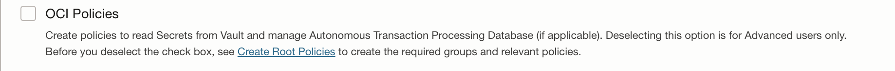

# Dynamic Groups in integration01 Tenancy

Our tenancy has several dynamic groups available for shared usage.  The idea here is that we can share dynamic groups if the task needed is common amongst many users.  By simply adding a compartment ID to an existing dynamic group, we can often avoid creating a new one.  This allows us to use shared policies as well.

## Examples 

Not all of the following have been done for our tenancy yet, see below for what is available.  Here are some potential items:

- WebLogic Stack
- Logging Analytics
- ADB Resource Principal
- DevOps Resource Principal
- Data Catalog Metastore
- Oracle Data Integration

## Shared Dynamic Groups (Implemented)

WebLogic Stack installations have a checkbox option to install a dynamic group and policy:

In order to uncheck this option, you must have a dynamic group and policy set ahead of time.  We have done this work for you, using:

- Dynamic group `cloud-engineering-shared-wlsc-principals-dg`
- Poicy `cloud-engineering-weblogic-dynamic-group-policies`

In order to use this, prior to creating a WebLogic or SOA Stack in your compartment, simply add your compartment OCID to this existing Dynamic Group's definition.  By doing so, all of the policy statements above will apply.  When you uncheck the Create Policies checkbox, it will still work.

## Suggestions

If you have a suggestion, please reach out via #integration01_tenancy_collaboration or orasenatdpltintegration01_us@oracle.com
