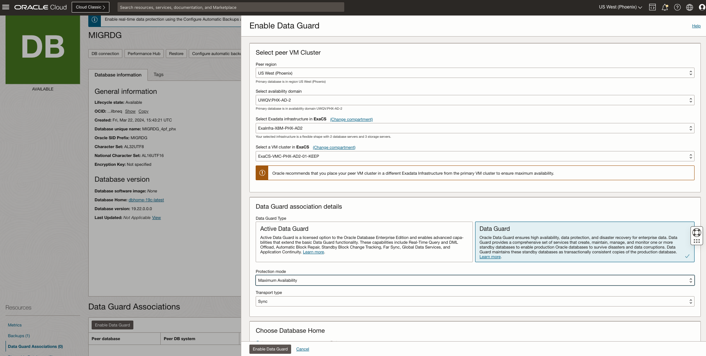
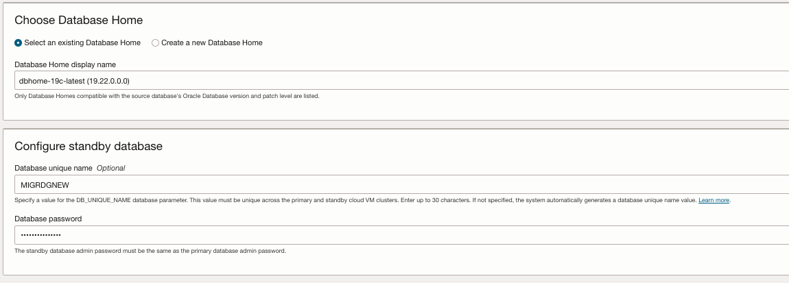
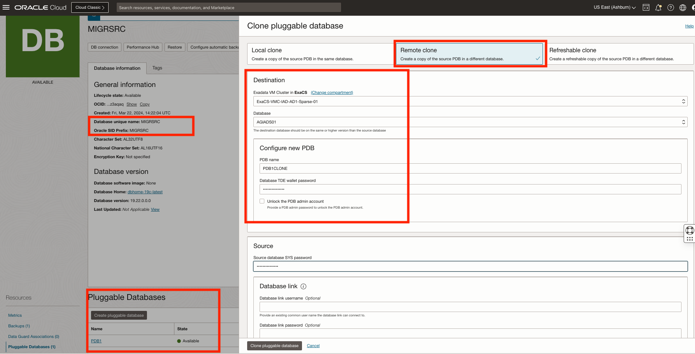
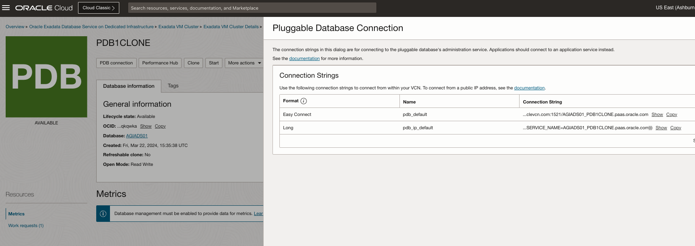
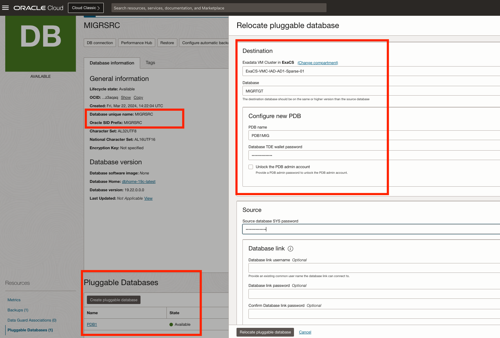
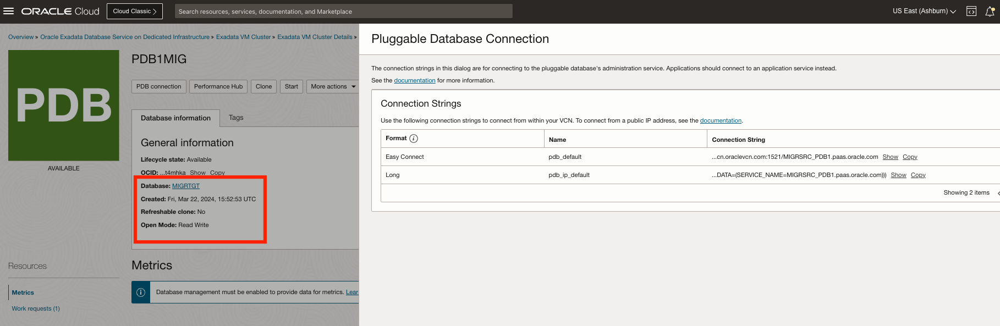
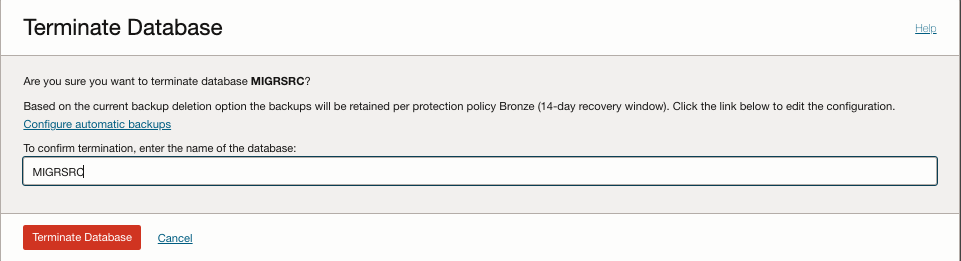

# Database Migration (WIP)

It may be necessary to demonstrate a migration between ExaCS environments.  This may be part of a demo or POC, or it may be required as we (administrators) re-do things or make updates.  For examplke, if a VM Cluster is to be de-commissioned, but you do not want to lose your database, this docuemnt gives you a couple of options.  Read on.

## Options

The options here:
* Set up Data Guard and Fail Over
* Relocate a PDB
* Clone a PDB

Data Guard is going to give you (and customers) the best experience in terms of uptime and availability.  It can be used for a migration as well.

For the Clone and Relocate options, you will need a Source and Target Container Database on different VM Clusters in the same region.  For these actions, it is recommended to have the source and target database at the same version, and retain the same administrator password.

### Data Guard

In this type of migration, you will first set up Oracle Data Guard, and then ensure it is working properly.  Following that, you will execute a failover, which will break the DG configuration, at which time you can terminate the (old)primary database.

First, create a standby database:




Verify that Data Guard is working:
```
TBD
```

Perform a Failover from the Standby using OCI Console or DGMGRL:

```
TBD
```

Once the Failover is complete, verify connectivity and Open Mode for the standby (now primary) database:

```
TBD
```

Now the source DB can be terminated.

### PDB Clone

In this method, you will be able to make a clone of a PDB to another Database (on another VM Cluster), and then verify it works, then terminate the original.  Before cloning, check source connectivity:

```bash

[opc@stuff ~]$ sqlplus sys@dbnode-giusq-scan.sub09231348061.exaiadvcn.oraclevcn.com:1521/MIGRSRC_PDB1.paas.oracle.com as sysdba

SQL*Plus: Release 19.0.0.0.0 - Production on Fri Mar 22 15:31:34 2024
Version 19.13.0.0.0

Copyright (c) 1982, 2021, Oracle.  All rights reserved.

Enter password:

Connected to:
Oracle Database 19c EE Extreme Perf Release 19.0.0.0.0 - Production
Version 19.22.0.0.0

SQL> select name from v$DATABASE;

NAME
---------
MIGRSRC
```

Cloning involves choosing a VM Cluster with an available Database to perform a remote clone to.



Once complete (10-15 min), log into the new cloned DB.  Here is the connection detail:



And the new connection detail:

```bash
[opc@stuff ~]$ sqlplus sys@kompally-zs9ta-scan.sub09231348061.exaiadvcn.oraclevcn.com:1521/AGIADS01_PDB1CLONE.paas.oracle.com as sysdba

SQL*Plus: Release 19.0.0.0.0 - Production on Fri Mar 22 15:49:23 2024
Version 19.13.0.0.0

Copyright (c) 1982, 2021, Oracle.  All rights reserved.

Enter password:

Connected to:
Oracle Database 19c EE Extreme Perf Release 19.0.0.0.0 - Production
Version 19.22.0.0.0

SQL> select name from v$DATABASE;

NAME
---------
AGIADS01
```

Looking at the target database, log in as the CDB and see all of the PDBs:

```bash
[opc@stuff ~]$ sqlplus sys@kompally-zs9ta-scan.sub09231348061.exaiadvcn.oraclevcn.com:1521/AGIADS01_jrj_iad.sub09231348061.exaiadvcn.oraclevcn.com as sysdba

SQL*Plus: Release 19.0.0.0.0 - Production on Fri Mar 22 16:02:32 2024
Version 19.13.0.0.0

Copyright (c) 1982, 2021, Oracle.  All rights reserved.

Enter password:

Connected to:
Oracle Database 19c EE Extreme Perf Release 19.0.0.0.0 - Production
Version 19.22.0.0.0

SQL> COLUMN NAME FORMAT A15
COLUMN RESTRICTED FORMAT A10
COLUMN OPEN_TIME FORMAT A30

SELECT NAME, OPEN_MODE, RESTRICTED, OPEN_TIME FROM V$PDBS;
SQL> SQL> SQL> SQL>
NAME		OPEN_MODE  RESTRICTED OPEN_TIME
--------------- ---------- ---------- ------------------------------
PDB$SEED	READ ONLY  NO	      20-MAR-24 01.35.13.419 PM +00:00
PDB1		READ WRITE NO	      20-MAR-24 01.35.22.953 PM +00:00
PDB1CLONE	READ WRITE NO	      22-MAR-24 03.41.25.583 PM +00:00
```

At this point the source database could be terminated, provided all PDBs are cloned or migrated.

### PDB Relocate

Similar to cloning, the DB itself is moved to an entirely different database.  In the example below, the MIGRSRC Database has a PDB named PDB1 that we want to migrate to a Database called MIGRTGT on another VM Cluster.  Start by verifying connectivity to the source:

```bash

[opc@stuff ~]$ sqlplus sys@dbnode-giusq-scan.sub09231348061.exaiadvcn.oraclevcn.com:1521/MIGRSRC_PDB1.paas.oracle.com as sysdba

SQL*Plus: Release 19.0.0.0.0 - Production on Fri Mar 22 15:31:34 2024
Version 19.13.0.0.0

Copyright (c) 1982, 2021, Oracle.  All rights reserved.

Enter password:

Connected to:
Oracle Database 19c EE Extreme Perf Release 19.0.0.0.0 - Production
Version 19.22.0.0.0

SQL> select name from v$DATABASE;

NAME
---------
MIGRSRC
```

Now migrate the PDB to another Database. Note that you can change the name here, as shown.



Once complete, verify that you can log in:



```bash
[opc@stuff ~]$ sqlplus sys@kompally-zs9ta-scan.sub09231348061.exaiadvcn.oraclevcn.com:1521/MIGRSRC_PDB1.paas.oracle.com as sysdba

SQL*Plus: Release 19.0.0.0.0 - Production on Fri Mar 22 16:05:27 2024
Version 19.13.0.0.0

Copyright (c) 1982, 2021, Oracle.  All rights reserved.

Enter password:

Connected to:
Oracle Database 19c EE Extreme Perf Release 19.0.0.0.0 - Production
Version 19.22.0.0.0

SQL> select name from v$DATABASE;

NAME
---------
MIGRTGT
```

### Termination

Terminate the source database once the target of cloning or relocation is complete:


