# Using ExaCS or ADB-D

**UPDATE - Please read the [VCN Details](#vcn-connection-details) Section PRIOR to creating a VCN that you plan to attach to ExaCS**

These services both exist in the tenancy as a way for us to utilize dedicated resources and save on costs of using serverless Autonomous and DBaaS.  We have set these services up in such a way that engineers can use them.

All Infrastructure and VM Clusters exist in the compartment called `(root) / cloud-engineering-shared / ExaCS `.  The VCN that all shared clusters utilizes is attached to a Dynamic Routing Gateway, and this document will describe how to connect to this DRG from any other VCN in the region.

For patching details, see [Patching and DB Homes](#exacs-patching-and-database-homes).

# Diagram of Compartment, VCN, Infra, Clusters, Connections


# Creation of ExaCS Database
Create an ExaCS DB within one of the existing ExaCS VM Clusters.  We recommend using your initials as part of the database name.  Also note the SCAN name and IP addresses for the chosen DB Cluster.  The database will be created without Data Guard, which you can do in the next step.
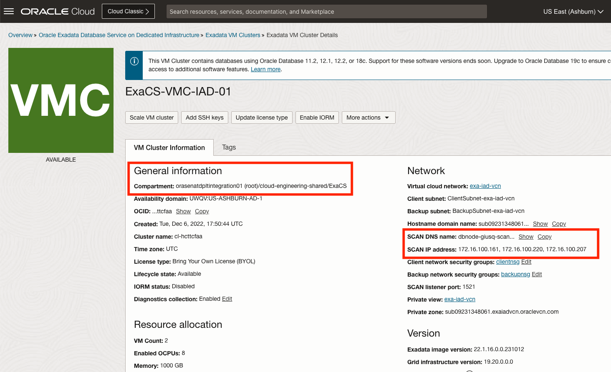
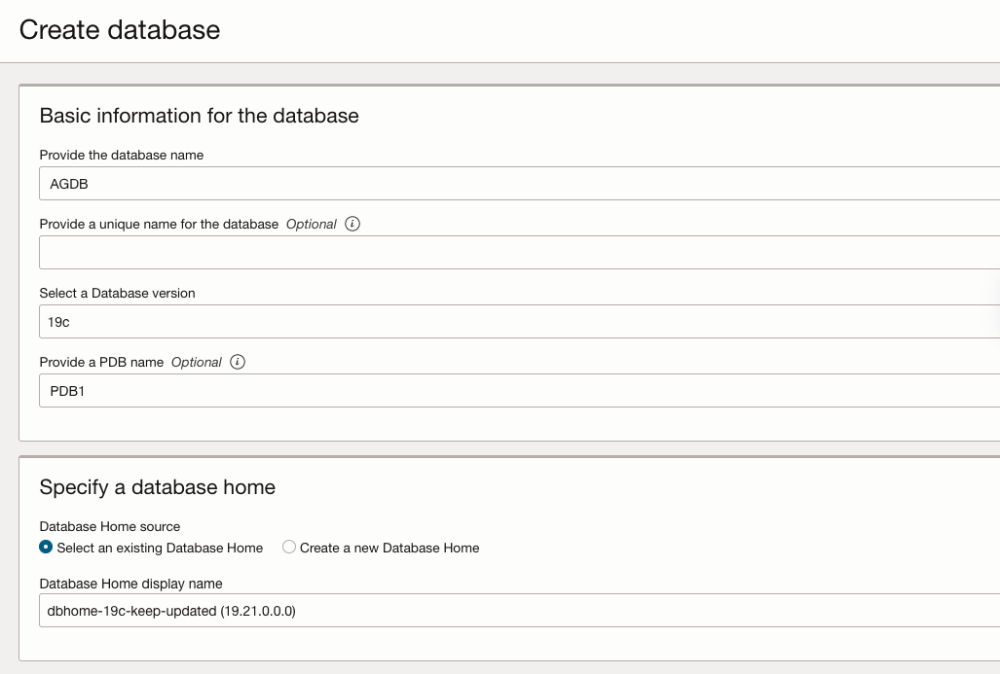

## Using Data Guard (ExaCS)
Once the database has been created, if Data Guard is required, set this up by associating the database with a peer in the same or remote region.  Be aware of cross-region charges that will occur.   
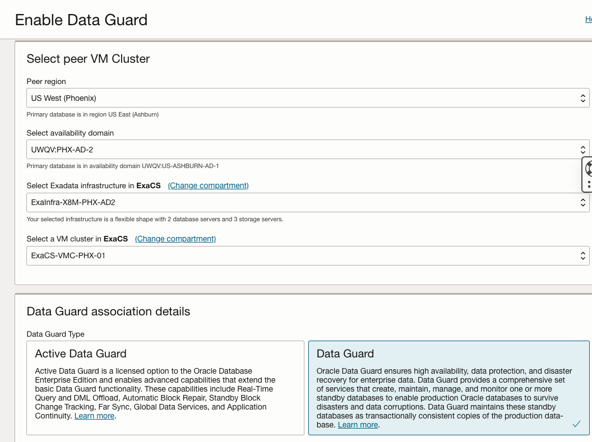

The Data Guard association can be edited or terminated after creation.
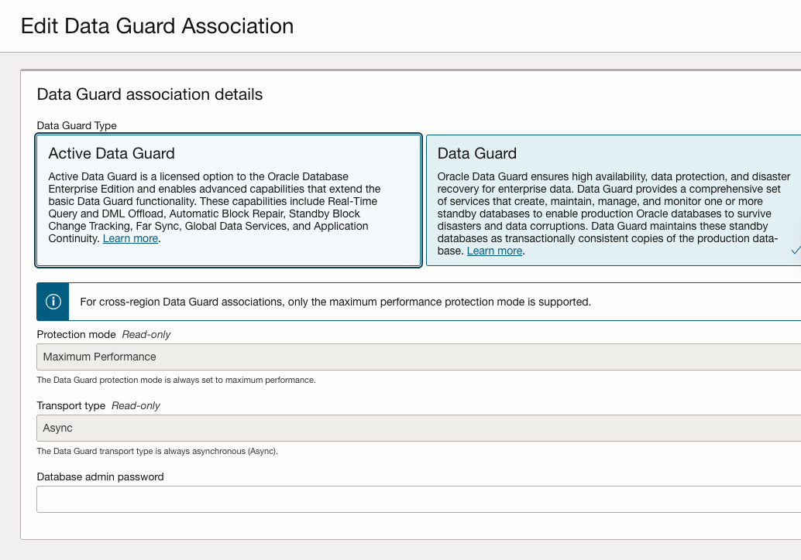
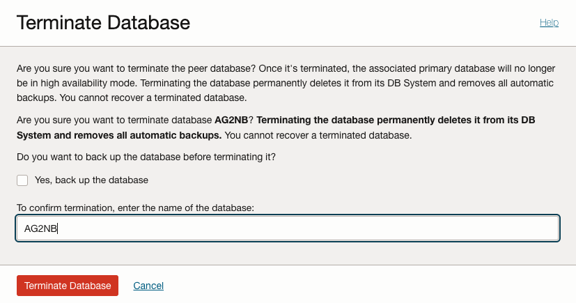

## Using Database Management
Enablement of DB Management and Operations Insights has already been done for the tenancy.  You need to enable the database for DB Management by following the instructions [here](./DB-TOOLS-README.md)

# Creation of ADB Database
When creating an ADB-D instance, there are a couple of options to select from.

## Data Guard Options
Creation of an ADB-D instance is done from within an Autonomous Container Database.  Use of Data Guard should be decided up front, as there are 2 ADB Autonomous Container Databases (ACD) to choose from.  One is enabled for Autonomous Data Guard, the other is not.  Placement of an ADB instance within one of these ACDs will dictate whether Data Guard is enabled for that database.
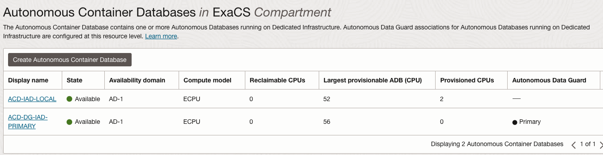

When choosing the Autonomous Container Databse, note the check box for Data Guard:
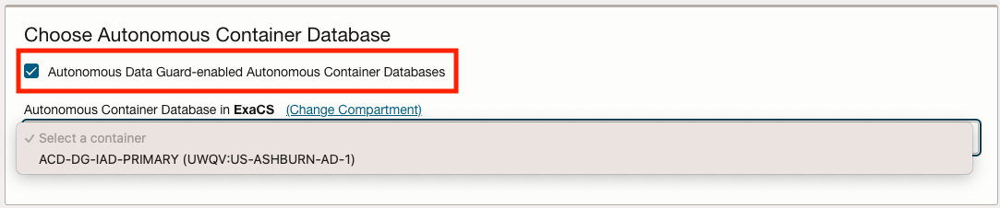
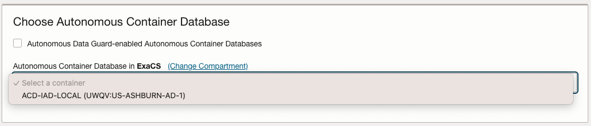

## ADB Free Option

Per the [announcement](https://blogs.oracle.com/database/post/introducing-autonomous-database-for-developers) of Free ADB-D instances, this can be set up as an option.  Simply select the ACD without Data Guard.

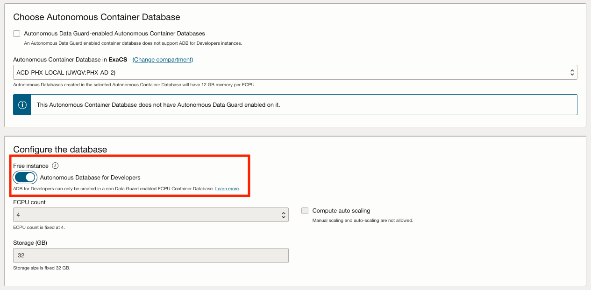

## ADB Network Access (ACL)
By default an ADB instance will be open to conenctions that are allowed into the Client Security List for the Autonomous VM Cluster.  If you want to restrict this, you can add an ACL, limiting connections to your ADB-D instance to IP addresses coming from your subnet.  To do this, find your private subnet (where an application or workload requiring DB access might live) and add it to the ACL.  If there is a Data Guard Instance, add that as well.

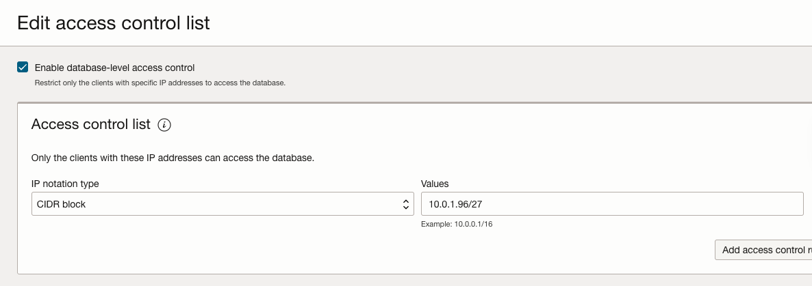
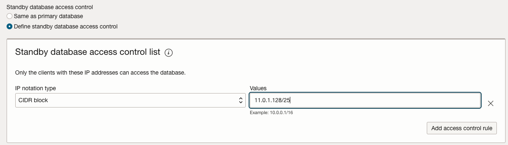

# VCN Connection Details
In order to access a database in the ExaCS VCN, you need to attach your VCN to the same DRG.  See the architecture diagram above for a visual.  This requires that your VCN be in a compatible CIDR range, have a subnet with a route rule to the DRG, and allow egress to the ExaCS VCN.  Screen shots are below for these configurations.  Additionally, it is convenient to use a VCN DNS Resolver with a private view, which allows VMs, applications, etc in your VCN to look up the SCAN Name of the database and get the IP addresses for the listener.

## Ranges required for ExaCS and your VCN
These are the Client Subnet ranges are for the ExaCS VCN, where all databases are created:

* Ashburn IAD - 172.16.100.128/25
* Phoenix PHX - 172.17.100.128/25

### Determining your VCN CIDR

For a CURRENT list of in-use CIDR blocks, please see this link:
[CIDR Blocks](resources/drg_attachments_latest.md)

Using this list, please determine an unused X and Y to make a VCN.  The pattern could look like this:
* 10.X.Y.0/24 (Ashburn) 
* 11.X.Y.0/24 (Phoenix)

As long as the same X and Y range is open in both regions, it makes sense to use the same X and Y in both, and then build your subnets in the VCN accordingly.
 

## DRG Attachment
Attach your VCN to the DRG in the appropriate region:

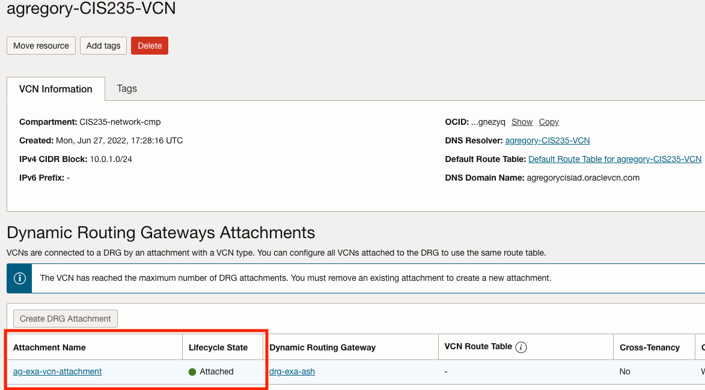

## DNS Resolver
Add the EXISTING DNS Resolver Private View to ExaCS VCN - you will need to use the compartment browser to find `cloud-engineering-shared/ExaCS`:
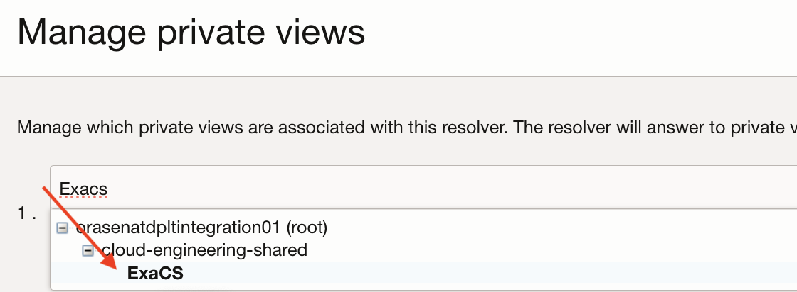

Choose `exa-iad-vcn` for Ashburn or `exa-phx-vcn` for Phoenix.  Do not create your own private view.


### Route to DRG
Add a route from your subnet's route table to DRG for the ExaCS Client Subnet CIDR Block:

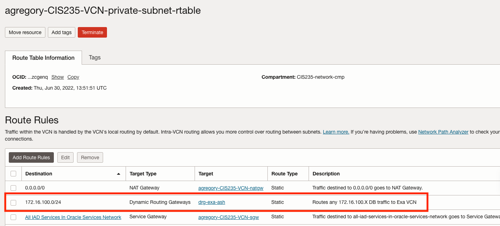

### Security List or NSG
Add Egress TCP/1521 for the block above:

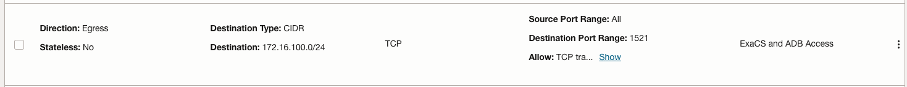

### Client VM
In your VCN, use the established security list or NSG to ensure connectivity.  In the example below, the NSG is added to the VM, ensuring egress to the ExaCS client range:

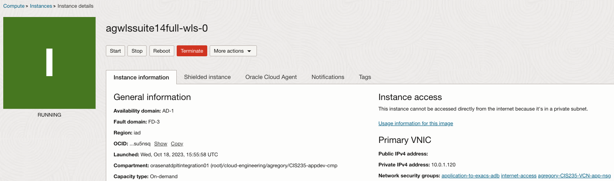

## Connection Details
In order to test connectivity or work with SQL Plus, install it on a VM in your own VCN:

```bash
sudo dnf install oracle-instantclient-release-el8
sudo dnf install oracle-instantclient-basic
sudo dnf install oracle-instantclient-sqlplus
```
## Ensure nslookup and nc work
Before connecting to any DB, please check both that the SCAN Listeners are able to nslookup and can connect on port 1521:

#### ExaCS IAD VM Cluster (example)

```bash
[opc@engineer-vm ~]$ nslookup exacs-iad01-3tjlf-scan.sub09231348061.exaiadvcn.oraclevcn.com
Server:		169.254.169.254
Address:	169.254.169.254#53

Non-authoritative answer:
Name:	exacs-iad01-3tjlf-scan.sub09231348061.exaiadvcn.oraclevcn.com
Address: 172.16.100.157
Name:	exacs-iad01-3tjlf-scan.sub09231348061.exaiadvcn.oraclevcn.com
Address: 172.16.100.160
Name:	exacs-iad01-3tjlf-scan.sub09231348061.exaiadvcn.oraclevcn.com
Address: 172.16.100.181
```
NC output
```bash
[opc@engineer-vm ~]$ nc -vz exacs-iad01-3tjlf-scan.sub09231348061.exaiadvcn.oraclevcn.com 1521
Ncat: Version 7.70 ( https://nmap.org/ncat )
Ncat: Connected to 172.16.100.160:1521.
Ncat: 0 bytes sent, 0 bytes received in 0.01 seconds.
```
#### ExaCS IAD ADB VM Cluster (example)

```bash
[opc@engineer-vm ~]$ nslookup host-knpvi-scan.sub09231348061.exaiadvcn.oraclevcn.com
Server:		169.254.169.254
Address:	169.254.169.254#53

Non-authoritative answer:
Name:	host-knpvi-scan.sub09231348061.exaiadvcn.oraclevcn.com
Address: 172.16.100.190
Name:	host-knpvi-scan.sub09231348061.exaiadvcn.oraclevcn.com
Address: 172.16.100.231
Name:	host-knpvi-scan.sub09231348061.exaiadvcn.oraclevcn.com
Address: 172.16.100.192
```
NC Output
```bash
[opc@engineer-vm ~]$ nc -vz host-knpvi-scan.sub09231348061.exaiadvcn.oraclevcn.com 1521
Ncat: Version 7.70 ( https://nmap.org/ncat )
Ncat: Connected to 172.16.100.192:1521.
Ncat: 0 bytes sent, 0 bytes received in 0.01 seconds.
```
### Connect to ExaCS instance
Use the `Database Connection` page from your ExaCS instance.  You can use either the long or easy connection.  This is because the DNS resolver is capable of resolving the SCAN listener of the database.

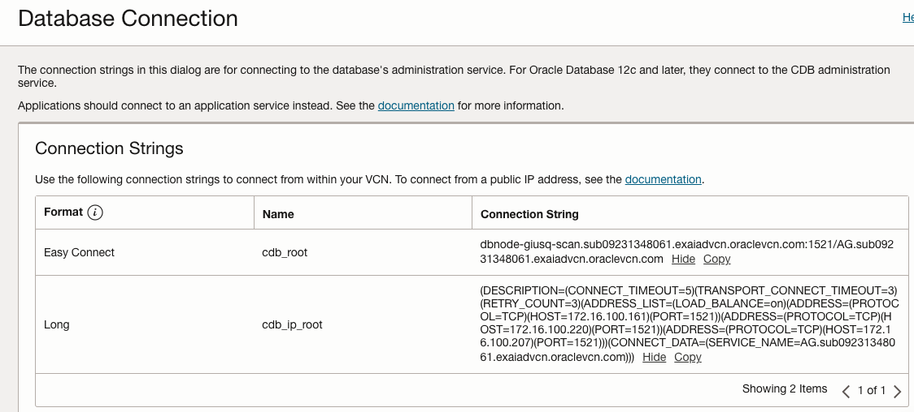

#### Example (Easy Connect)
```bash
[opc@engineer-vm ~]$ sqlplus sys/XXXXXXXX@dbnode-giusq-scan.sub09231348061.exaiadvcn.oraclevcn.com:1521/AG.sub09231348061.exaiadvcn.oraclevcn.com as sysdba
 
SQL*Plus: Release 19.0.0.0.0 - Production on Tue Nov 21 14:55:33 2023
Version 19.13.0.0.0

Copyright (c) 1982, 2021, Oracle.  All rights reserved.

Connected to:
Oracle Database 19c EE Extreme Perf Release 19.0.0.0.0 - Production
Version 19.21.0.0.0

SQL> 
```
#### Example (Long)
```bash
[opc@stuff ~]$ sqlplus sys/XXXXXXXX@(DESCRIPTION=(CONNECT_TIMEOUT=5)(TRANSPORT_CONNECT_TIMEOUT=3)(RETRY_COUNT=3)(ADDRESS_LIST=(LOAD_BALANCE=on)(ADDRESS=(PROTOCOL=TCP)(HOST=172.16.100.161)(PORT=1521))(ADDRESS=(PROTOCOL=TCP)(HOST=172.16.100.220)(PORT=1521))(ADDRESS=(PROTOCOL=TCP)(HOST=172.16.100.207)(PORT=1521)))(CONNECT_DATA=(SERVICE_NAME=AG.sub09231348061.exaiadvcn.oraclevcn.com))) as sysdba

SQL*Plus: Release 19.0.0.0.0 - Production on Tue Nov 21 15:01:13 2023
Version 19.13.0.0.0

Copyright (c) 1982, 2021, Oracle.  All rights reserved.

Connected to:
Oracle Database 19c EE Extreme Perf Release 19.0.0.0.0 - Production
Version 19.21.0.0.0

SQL> 
```
### Connect to ADB Instance
Connection to ADB can occur with or without downloading the Wallet.  Example using the connection string from the ADB Instance:

```bash
[opc@engineer-vm ~]$ sqlplus admin/XXXXXXXX@(DESCRIPTION=(CONNECT_TIMEOUT=90)(RETRY_COUNT=50)(RETRY_DELAY=3)(TRANSPORT_CONNECT_TIMEOUT=3)(ADDRESS_LIST=(LOAD_BALANCE=ON)(ADDRESS=(PROTOCOL=TCP)(HOST=host-knpvi-scan.sub09231348061.exaiadvcn.oraclevcn.com)(PORT=1521)))(CONNECT_DATA=(SERVICE_NAME=AGADBDG_medium.atp.oraclecloud.com)))
```

# ExaCS Patching and Database Homes

The ExaCS environments are patched regularly, in order to ensure we can meet the needs of our team, supporting the latest available versions (as possible).  All of the VM Clusters have been updated to Oracle Linux 8 (VM Patches 23.x).

Additionally, we keep the latest Grid Infrastructure up to date, and it is our goal to provide multiple DB Homes, without users needing to or wanting to create new homes for a single DB.

## Naming Conventions

DB Homes are named as follows:
* `dbhome-19c-keep-updated` - This should be versioned to the latest available Grid version.  Example, 19.22 as of early 2024
* `dbhome-19c-n-minus-1` - Version N-1, whatever the latest version is, minus 1.  Example, 19.21
* `dbhome-19c-n-minus-2` - Version N-2, whatever the latest version is, minus 2. Example, 19.20

Engineers creating databases should NOT create a new DB Home, but instead use one of the provided homes on each VM Cluster.  If there is specific need for another home, let us know and we can create that.
