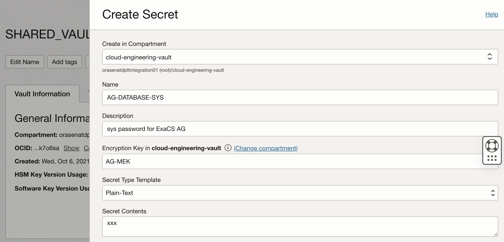
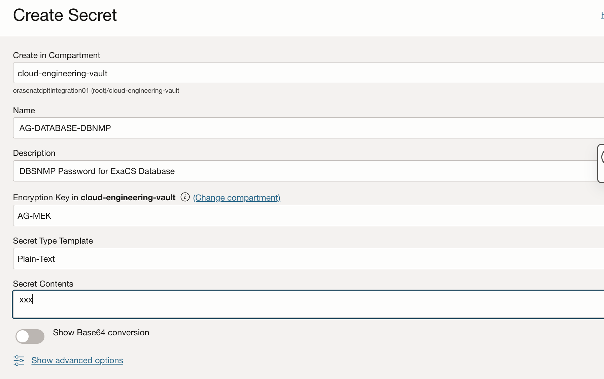
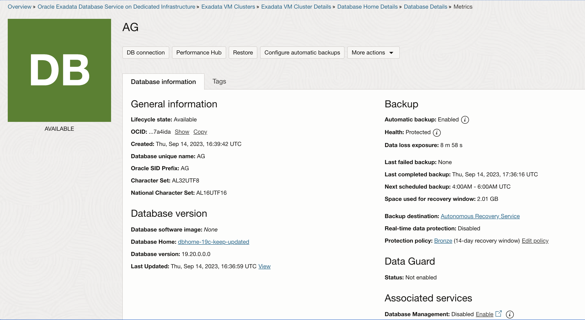
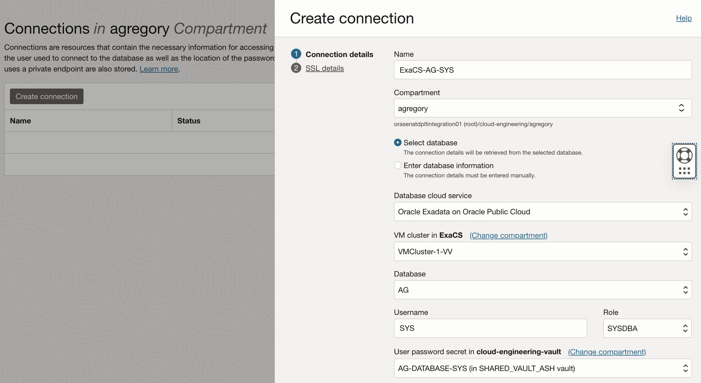
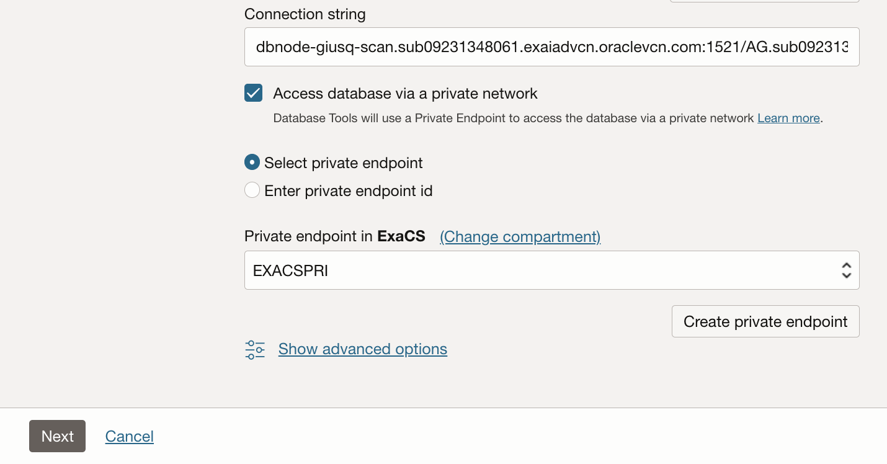
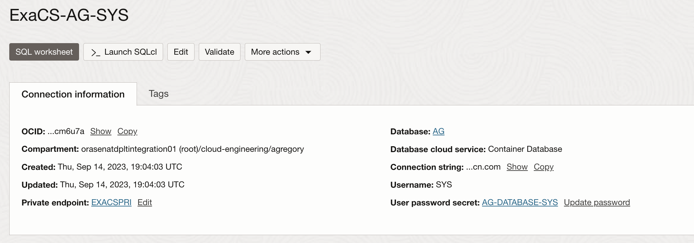

# Using Integration01 Tenancy
This repo contains mostly documentation and examples for using the `orasenatdpltintegration01` tenancy.  It is not standard product documentation, but rather aims to show where variations were made in order to share resources.  Each section below will cover basic usage of a particular area within the tenancy.

## Shared OCI Vault
All engineers can and should use the `SHARED_ASH_VAULT` within the `clopud-engineering-vault` compartment.  This prevents everyone from needing to maintain their own vault.  All services requiring vault access should be enabled and working with keys from the vault.

### Examples (Needed for SQL Worksheet and DB Management)



### Master Encryption Keys
It is recommended to create a MEK with your initials at the front, ie `AG-MEK`, so it is easy to find when creating secrets.  
### Secrets
Secrets can be created for various database and middleware products.  Follow the same strategy as above, prepending your initials.  The secret should reflect what it is.  Example: `AG-WLS-PWD` or `AG-DATABASE-SYS`.
### Usage
Remember to select the `cloud-engineering-vault` compartment from any screen asking for a Vault-based password.

## Shared ExaCS
All engineers can create an ExaCS Database in /ExaCS in one of the VM Clusters.  You can use SQL Worksheet to connect to your database directly from the browser (see below). In order to connect to this database from your own VCN, you need to do some pre-requisite work with your VCN and the Dynamic Routing Gateway that is attached to the ExaCS VCN.  More details below.

### Example

### Autonomous Recovery
Databases within ExaCS are enabled for use within ASR.  This can be enabled when the database is created or after the fact.  Once enabled, check both the Protected Databases screen and the Backups screen for your DB to ensure you are getting valid backups.

### ASR Example


### SQL Worksheet / DB Tools
The tenancy now allows for the use of SQL Worksheet.  You can create a connection within your own compartment.  Steps:
1) Create a secret in the cloud-engineering-vault for the SYS password you used when creating your database
2) Create a Connection under DB Tools using this secret (connect as SYSDBA).  Select the Private Endpoint called `EXACSPRI` within the `ExaCS` compartment.
   a) The wallet screen is optional
4) Enter SQL Worksheet and ensure your connection is selected

### SQL Worksheet Example




## Database Management
Databases on ExaCS are eligible for both Basic and Full management using Database Management.  Be judicious about using full management.  You can switch back and forth between versions and enabled/disabled.  Steps:
1) Enable the DBSNMP user in your database.  You can do this via SQL Worksheet.  You can use the same password as sys or a new one 
```sql
ALTER USER dbsnmp ACCOUNT UNLOCK;
ALTER USER dbsnmp IDENTIFIED BY xxxx;
GRANT CREATE PROCEDURE to DBSNMP;
GRANT SELECT ANY DICTIONARY, SELECT_CATALOG_ROLE to DBSNMP;
GRANT ALTER SYSTEM to DBSNMP;
GRANT ADVISOR to DBSNMP;
GRANT EXECUTE ON DBMS_WORKLOAD_REPOSITORY to DBSNMP;
```
2) If you chose a new password for DBSNMP, create another secret in the cloud-engineering-vault for the DBSNMP password you used above
3) Follow the Database Management enablement wizard from your database (do not select "add policy" - this is done already)
4) Choose the private endpoint called `ExaCS_PE` within the ExaCs compartment
5) Choose Full or Basic

### Database Management Example


If you can enabled full management and ran the DBSNMP grants above, you will see the Performance Hub:


## Connecting to ExaCS from your VCN

TBD
